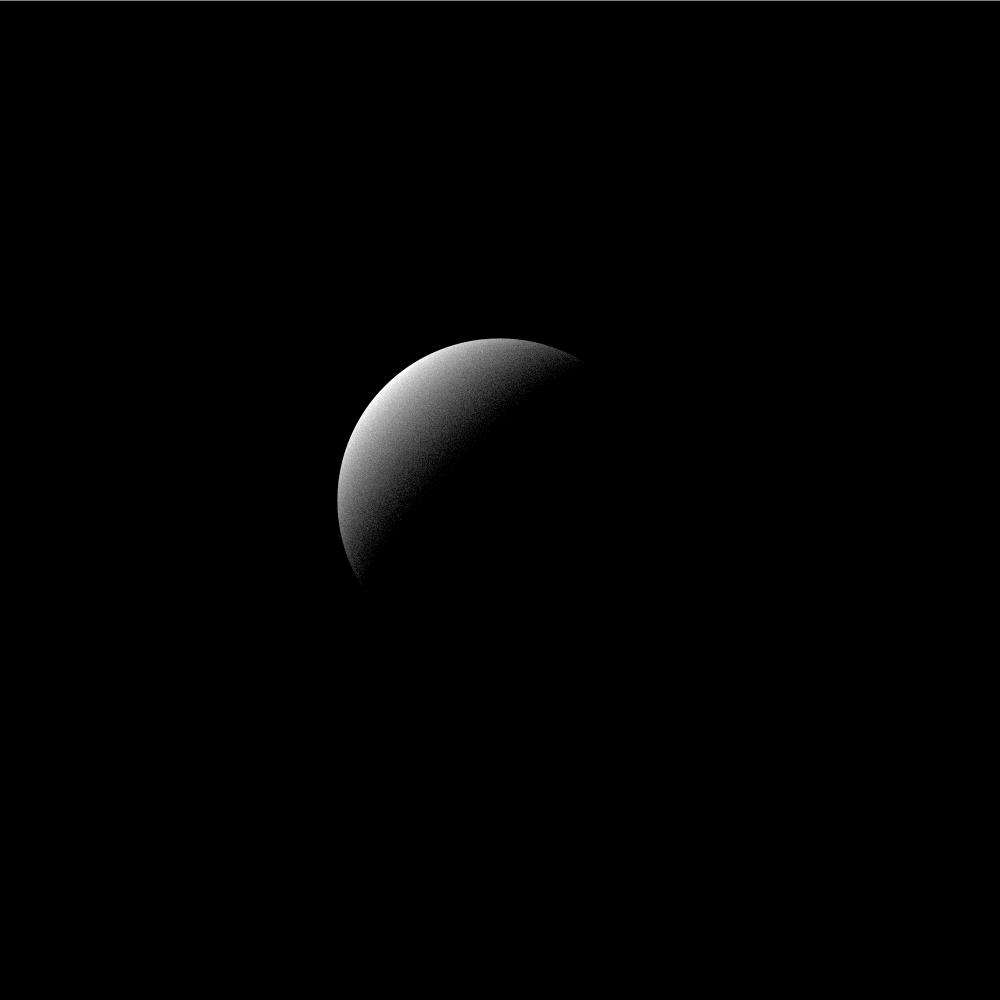
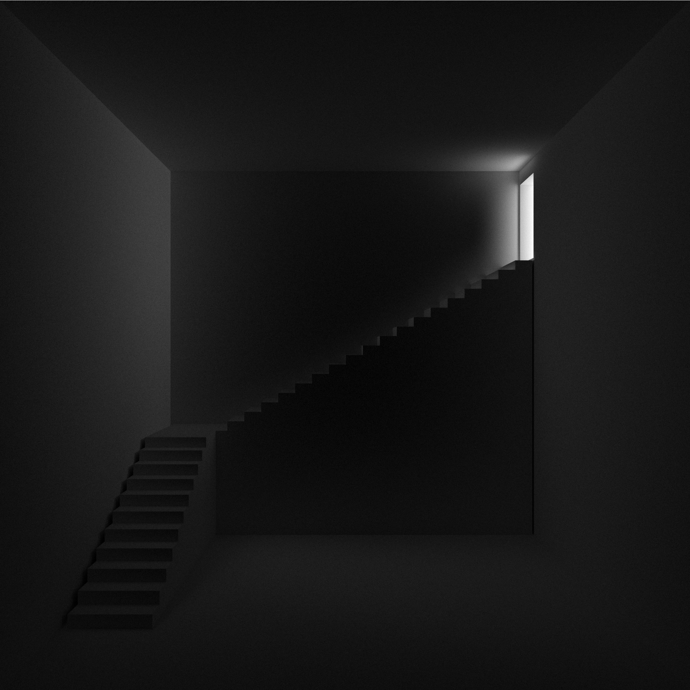

# RAYTRACER
A toy raytracer written in Go, based on https://raytracing.github.io/books/RayTracingInOneWeekend.html 

A raytracer was on my programming bucket list for a *long* time, finally got around to making one. I picked Go because I wanted to learn it for a while and also because it has a built-in concurrency model, perfect for big computations. I'm pretty happy with the results, even though it is painfully slow for anything with more than a couple of triangles.

## Showcase

## Running
Run `go run *.go` or `go build` and then run the binary `./raytracer`

## Features
- unidirectional path tracing
- spheres and triangles as primitives
- diffuse, glossy, refractive and emissive materials
- positionable camera with depth of field
- *very* basic `.obj` parsing, supports triangulated meshes only

### Future wish list
- performance improvements:
  - bounding volume hiearchies
  - light sampling or bidirectional path tracing
